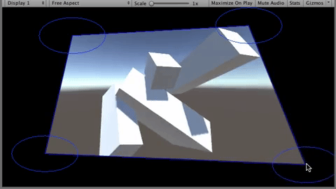

# Unity Homography Image Effect

Homography implementation as an ```ImageEffect``` for Unity. Useful for projecting content on flat surfaces.



*I first worked on homography as part of an upgrade of [Dpt](https://dpt.co/home)'s [Parade](https://dpt.co/work/parade-dancing-shadow-sculptures) interactive installation.*

## What's this?

Say you want to project content on a flat surface, and that your projector's orientation is not exactly perpendicular to the projection surface. Your content will appear distorted / skewed. This tool lets you fix that, by transforming your content in a way that compensates for the physical distortion.


## Code Organization

Scripts:
- ```HomographyImageEffect```: Homography imgae effect, to be added to the camera
- ```ViewportGizmo```: required by ```HomographyImageEffect```, responsible for providing a simple user interface
- ```TouchEmulation```: helper script letting our tool work with either the mouse or touches.

Shaders:
- ```Homography```: shader used by ```HomographyImageEffect```

Dependencies:

We use the [Math.NET](https://www.mathdotnet.com/) library, for its [Singular Value Decomposition](https://en.wikipedia.org/wiki/Singular-value_decomposition) algorithm, used to compute the homography transform matrix based on user transformed points.

## Usage

To configure the tool, you move your viewport's corners to their desired positions. You may do so using a mouse / fingers, dragging those corners around, or use the arrow keys to get a more refined positioning.

Press ```[H + Ctrl]``` to enter edit mode, ```[Ctrl]``` to exit. Once in edit mode:
- use mouse / touch to drag corners
- use the alphanumeric keys (0, 1, 2, 3) to select corners, then arrow keys to move them
- press ```[R]``` to reset the transform

Your settings are save as ```PlayerSettings``` on edit mode exit.

Relevant shader parameters, exposed by ```HomographyImageEffect```:
- **edge smoothness**: lets you soften the edges of the transformed content
- **background color**: self explanatory ;)
